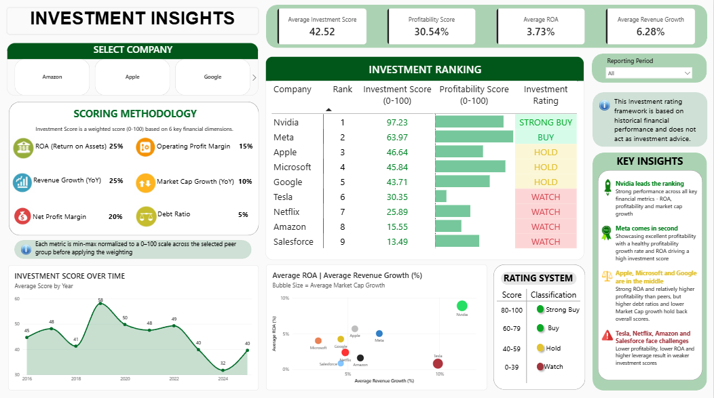
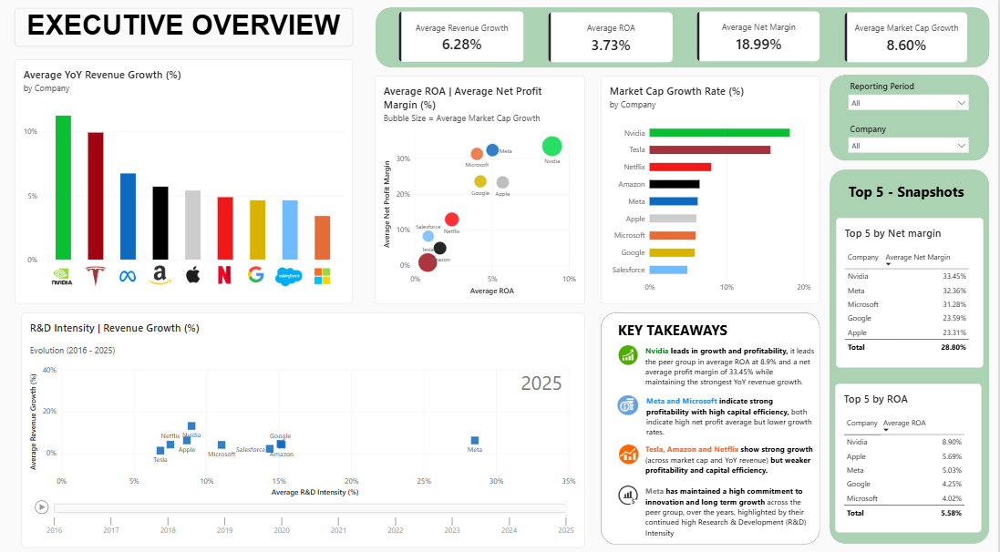
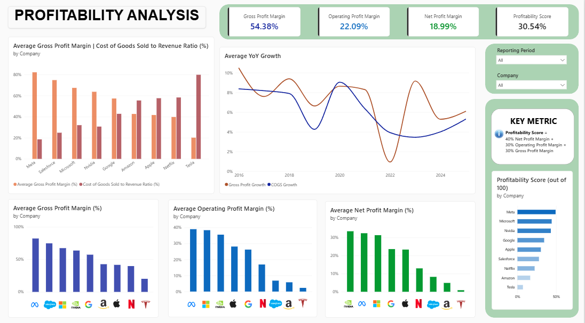
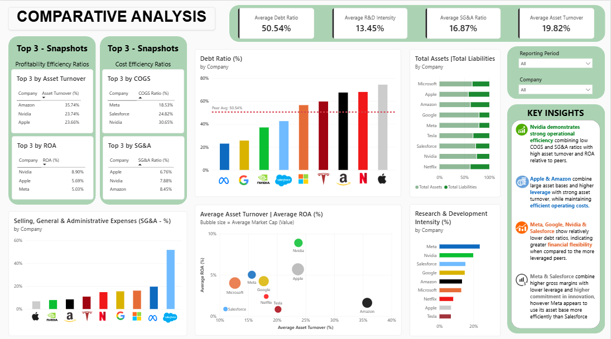

# Technology Sector Financial Performance & Investment Analysis

## Project Overview

This end-to-end financial analytics project analyses the quarterly financial
performance of nine major technology companies from 2016–2025.

The project combines PostgreSQL, SQL, Power BI and DAX to transform financial
statement data into an interactive dashboard covering financial performance,
profitability, peer benchmarking and historical investment analysis.

The analysis evaluates growth, profitability, operational efficiency,
capital structure and asset utilisation before combining selected indicators
into a 0–100 comparative investment scoring framework.

---

## Business Problem

How do major technology companies differ in financial growth, profitability,
operational efficiency and capital structure, and how can these indicators
be combined into a consistent framework for peer comparison?

---

## Objectives

- Compare financial performance across nine major technology companies
- Analyse revenue and earnings growth over time
- Evaluate profitability and return on assets
- Assess operational efficiency and asset utilisation
- Compare capital structure and debt levels
- Examine R&D investment relative to revenue
- Analyse market capitalisation growth
- Develop a peer-relative 0–100 investment scoring framework
- Translate financial analysis into actionable business insights

---

## Companies & Dataset

### Companies Analysed

- Amazon
- Apple
- Google
- Meta
- Microsoft
- Netflix
- Nvidia
- Salesforce
- Tesla

### Dataset

- Financial statement data
- Income Statement and Balance Sheet data
- Period: 2016–2025
- Frequency: Quarterly
- Companies: 9
- Source files: `income_statement.csv` and `balance_sheet.csv`

The datasets include revenue, cost of sales, gross profit, SG&A,
R&D expenditure, operating profit, net income, total assets,
liabilities and market capitalisation.

---

# Dashboard Screenshots

## Investment Insights

The Investment Insights page combines the selected financial indicators into
a weighted historical investment scoring framework.

## Executive Overview

The Executive Overview provides a high-level comparison of growth,
profitability, market capitalisation and key financial trends across the
peer group.

## Profitability Analysis

The Profitability Analysis page evaluates gross, operating and net
profitability alongside financial performance trends.

## Comparative Analysis

The Comparative Analysis page benchmarks companies across asset utilisation,
leverage, operational efficiency and R&D investment.

---

# Key Findings

1. **Nvidia demonstrated the strongest overall financial profile**, achieving
   the highest Investment Score under the project's historical peer-relative
   scoring framework.

2. **Meta demonstrated strong profitability**, supported by comparatively
   strong gross and operating margins and a high overall position within the
   Profitability scoring framework.

3. **Nvidia demonstrated strong financial efficiency and profitability**, combining
   high Return on Assets (ROA of 8.9%) with a strong net profit margin of 33.45%
   relative to the peer group.

4. **Growth and profitability do not always move together.** Companies such
   as Tesla displayed notable growth characteristics while showing comparatively
   weaker performance in selected profitability or efficiency measures.

5. **R&D investment varied substantially across the peer group**, with Meta,
   Nvidia and Salesforce demonstrating significant investment in research and
   development relative to their revenue base.

---
# Profitability Scoring Framework

A 0–100 historical Profitability Score was developed to provide a consistent
peer-relative comparison across the nine companies.

| Metric | Weight |
|---|---:|
| Net Profit Margin | 40% |
| Gross Profit Margin | 30% |
| Operating Profit Margin | 30% |

The profitability score is calculated as:

    Profitability Score = 40% × Net Profit Margin + 30% × Gross Profit Margin + 30% × Operating Profit Margin

---

# Investment Scoring Framework

A 0–100 historical Investment Score was developed to provide a consistent
peer-relative comparison across the nine companies.

| Metric | Weight |
|---|---:|
| ROA | 25% |
| Revenue Growth | 25% |
| Net Profit Margin | 20% |
| Operating Profit Margin | 15% |
| Market Capitalisation Growth | 10% |
| Debt Ratio | 5% |
| **Total** | **100%** |

Each metric is normalised to a 0–100 scale using min-max normalisation across
the selected peer group before the weights are applied.

For metrics where higher values indicate stronger performance:

    Normalised Score = (Current Value - Peer Minimum) / (Peer Maximum - Peer Minimum) × 100

Debt Ratio is scored in the opposite direction because a lower debt ratio is preferred:

    Debt Score = (Peer Maximum - Current Value) / (Peer Maximum - Peer Minimum) × 100

The final Investment Score is calculated as:

    Investment Score = 25% × ROA Score + 25% × Revenue Growth Score + 20% × Net Margin Score + 15% × Operating Margin Score + 10% × Market Cap Growth Score + 5% × Debt Score

### Investment Ratings

| Score | Rating |
|---:|---|
| 80–100 | Strong Buy |
| 60–79 | Buy |
| 40–59 | Hold |
| 0–39 | Watch |

The investment ratings are model-generated classifications based on
historical financial performance and peer-relative normalisation. They are
not investment recommendations.

---

# Data & SQL Process

The project uses a three-stage PostgreSQL and SQL workflow:

    Raw CSV Data
        ↓
    Excel
        ↓
    PostgreSQL Tables
        ↓
    Data Cleaning
        ↓
    Cleaned Financial Views
        ↓
    Consolidated Financial Performance View
        ↓
    Power BI
        ↓
    DAX Measures & Scoring
        ↓
    Interactive Dashboard

### SQL Workflow

**01_create_tables.sql**

Creates the PostgreSQL tables used to store the income statement and balance
sheet datasets.

**02_create_cleaned_views.sql**

Cleans and standardises the raw financial data, converts text-based financial
fields to numeric values, handles missing values and calculates initial
profitability metrics.

**03_consolidated_calc_view.sql**

Joins the cleaned income statement and balance sheet data and creates the
`financial_performance` analytical view.

The consolidated view includes:

- Revenue and financial growth metrics
- Gross, operating and net margins
- R&D intensity
- SG&A ratio
- Debt ratio
- Return on Assets
- Asset turnover
- Market capitalisation growth

### Key SQL Techniques Applied

- Common Table Expressions (CTEs)
- Window functions (`LAG()` for quarter-over-quarter (QoQ) growth calculations and `PARTITION BY` for company-level time-series comparisons)
- SQL Views
- Data type conversion
- Financial ratio calculations, including gross margin, operating margin, net margin, debt ratio, ROA and asset turnover
- Time-series analysis
- Data consolidation

# Files included
- Dashboard Screenshots (`.png`)
- Power BI Dashboard (`.pbix`)
- SQL scripts (`.sql`)
- Datasets (`.csv`)
- README Documentation

